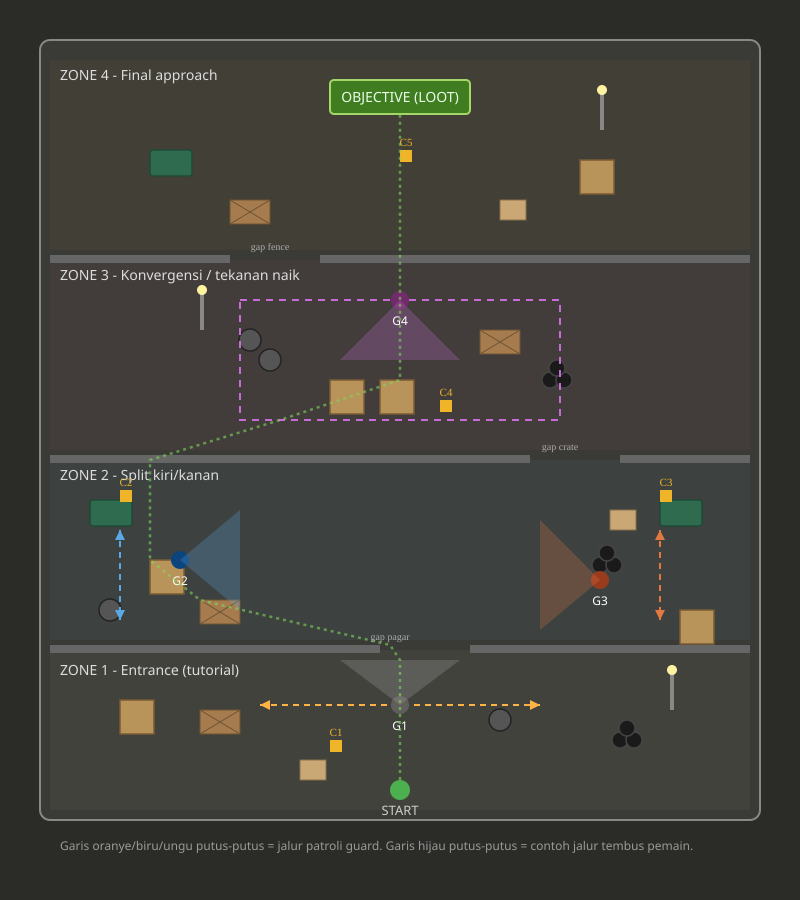

# Rancangan Layout Stealth Level — Warehouse Exterior (4 Zone)

## Sketsa

Garis putus-putus oranye/biru/ungu = jalur patroli tiap guard.
Garis putus-putus hijau = salah satu contoh jalur tembus pemain dari start ke objective.
Kotak kuning kecil (C1–C5) = lokasi kaleng distraksi.

---

## 1. Konsep Umum

Level ini merupakan **eksterior warehouse** (bukan interior seperti Robbery Bob asli), sehingga struktur "ruangan" diadaptasi menjadi **zone** yang dipisahkan oleh barrier fisik yang tetap masuk akal secara environment outdoor — seperti pagar, deretan crate, atau fence row — bukan tembok/pintu literal.

- **Start**: pemain masuk dari sisi bawah (selatan) warehouse.
- **Objective**: peti/barang curian (loot) berada di zone paling atas (utara), direpresentasikan sebagai persegi panjang hijau.
- **Total guard**: 4
- **Total kaleng (distraction can)**: 5
- **Jumlah zone**: 4, tersusun dari entrance hingga objective dengan tingkat kesulitan meningkat secara bertahap.

---

## 2. Breakdown Per Zone

### Zone 1 — Entrance (Tutorial)
- **Fungsi**: memperkenalkan mekanik dasar stealth & distraksi kepada pemain, risiko rendah.
- **Guard**: **G1** — patroli horizontal bolak-balik lurus di depan titik masuk. Cone menghadap ke bawah, menutup jalur langsung.
- **Kaleng**: **C1** — diletakkan agak menyamping dari jalur patroli G1, memancing guard bergerak menjauh sehingga membuka celah masuk.
- **Obstacle**: crate, pallet, barrel, tires, cardboard box, light pole — kepadatan sedang, cukup untuk cover dasar tanpa membuat zone terasa sesak.
- **Barrier keluar zone**: pagar dengan 1 celah (gap) di tengah menuju Zone 2.

### Zone 2 — Split Kiri/Kanan
- **Fungsi**: memberi pemain pilihan rute nyata (kiri vs kanan), masing-masing dengan risk/reward berbeda.
- **Guard**:
  - **G2** (lorong kiri) — patroli vertikal pendek, cone menghadap ke kanan menutup lorong kiri.
  - **G3** (lorong kanan) — patroli vertikal pendek juga, namun sengaja dibuat sedikit berbeda (cone lebih lebar tapi jarak pandang lebih pendek) supaya kedua sisi tidak terasa identik/simetris.
- **Kaleng**:
  - **C2** — dekat G2, untuk memancing guard kiri.
  - **C3** — dekat G3, untuk memancing guard kanan.
- **Obstacle**: sisi kiri didominasi dumpster, crate, barrel; sisi kanan didominasi dumpster, tires, crate, cardboard — komposisi berbeda supaya kedua lorong punya identitas visual sendiri.
- **Barrier keluar zone**: deretan crate dengan gap di sisi kanan (offset dari gap Zone 1→2 supaya jalur pemain tidak lurus, memaksa sedikit weaving).

### Zone 3 — Konvergensi / Tekanan Naik
- **Fungsi**: titik di mana dua jalur (kiri & kanan) bertemu kembali sebelum area final. Di sinilah tensi mulai naik signifikan.
- **Guard**: **G4 (fase awal)** — patroli mengelilingi area tengah zone dalam pola loop persegi (bukan garis lurus), sehingga pemain harus membaca timing rotasi, bukan sekadar bolak-balik sederhana.
- **Kaleng**: **C4** — diletakkan dekat jalur akhir loop G4, dipakai untuk membuka window singkat sebelum masuk Zone 4.
- **Obstacle**: kombinasi crate ganda di tengah (blok cover besar) + barrel cluster + pallet + tires + light pole — kepadatan obstacle paling tinggi di sini untuk mendukung mekanik "curi lihat" dari balik cover saat guard berpatroli.
- **Barrier keluar zone**: fence row dengan gap di sisi kiri (offset lagi dari gap sebelumnya).

### Zone 4 — Final Approach
- **Fungsi**: klimaks level, area terakhir sebelum mengambil loot.
- **Guard**: penjagaan area ini merupakan lanjutan pola G4 dari Zone 3 (guard yang sama menjaga perbatasan Zone 3–4), sehingga total guard tetap **4 (G1–G4)** tanpa perlu guard tambahan — cukup perluas radius patroli G4 agar mencakup pendekatan akhir ke objective.
- **Kaleng**: **C5** — kaleng "high-risk", diletakkan sangat dekat objective. Opsional dipakai pemain yang berani ambil jalur agresif demi window ekstra sebelum grab loot.
- **Obstacle**: dumpster, crate, pallet, cardboard, light pole — disusun membentuk jalur sempit/linear (berbeda dari Zone 2 yang lebar) untuk memberi kesan "menyempit" secara visual maupun tekanan gameplay.

---

## 3. Daftar Obstacle yang Digunakan

| Obstacle | Fungsi utama | Zone pemakaian |
|---|---|---|
| Dumpster | Cover besar, blocking line-of-sight penuh | Zone 2, 4 |
| Crate | Cover fleksibel, bisa disusun rapat jadi barrier | Semua zone |
| Pallet | Cover rendah, cocok untuk zona lebih terbuka | Semua zone |
| Barrel | Cover kecil, biasa dipakai berkelompok | Zone 1, 2, 3 |
| Tires (ban) | Detail visual + cover kecil tambahan | Zone 1, 2, 3, 4 |
| Cardboard box | Detail kecil, dekorasi + sedikit blocking | Zone 1, 2, 4 |
| Light pole | Landmark visual, bukan cover (bantu orientasi) | Zone 1, 3, 4 |
| Fence / crate row | Barrier antar-zone dengan 1 gap | Antar zone |

---

## 4. Ringkasan Penempatan Guard & Kaleng

| ID | Tipe | Zone | Catatan |
|---|---|---|---|
| G1 | Guard | 1 | Patroli lurus horizontal, tutorial |
| G2 | Guard | 2 (kiri) | Patroli vertikal pendek |
| G3 | Guard | 2 (kanan) | Patroli vertikal, variasi cone dari G2 |
| G4 | Guard | 3–4 | Patroli loop, radius mencakup final approach |
| C1 | Kaleng | 1 | Memancing G1 |
| C2 | Kaleng | 2 | Memancing G2 |
| C3 | Kaleng | 2 | Memancing G3 |
| C4 | Kaleng | 3 | Membuka window sebelum Zone 4 |
| C5 | Kaleng | 4 | High-risk, dekat objective |

---

## 5. Catatan Desain & Playtesting

1. **Gap antar zone sengaja dibuat offset** (tidak segaris lurus dari bawah ke atas) supaya jalur pemain sedikit weaving, tidak terasa seperti koridor lurus membosankan.
2. **Pastikan cone guard tidak "bocor" lewat gap ke zone sebelah** — kalau gap terlalu lurus/lebar, vision cone dari satu zone bisa terlihat dari zone lain dan membingungkan pemain soal ancaman mana yang aktif.
3. **G2 dan G3 harus terasa berbeda**, meski fungsinya simetris — variasikan kecepatan, lebar cone, atau pola gerak supaya lorong kiri dan kanan masing-masing punya identitas.
4. **Zone 3 adalah titik terpadat obstacle** — cocok untuk mekanik "peek and hide", pastikan cover cukup rapat untuk itu tapi jangan sampai membuat guard mustahil dihindari.
5. **Ghost run test**: coba jalankan dari start ke objective sambil tahu semua timing patroli. Kalau ternyata selalu ada jalur aman tanpa pernah pakai kaleng, pertimbangkan mempersempit window guard. Kalau ternyata mustahil tembus tanpa kaleng sama sekali, longgarkan sedikit.
6. **C5 sebaiknya opsional**, bukan wajib — desain supaya level tetap bisa diselesaikan tanpa mengambilnya, tapi memberi keuntungan (misal waktu ekstra atau window lebih besar) bagi pemain yang berani mengambilnya.

---

*Dokumen ini disusun berdasarkan diskusi rancangan level stealth "Robbery Bob-style" untuk environment outdoor warehouse. Sketsa (`warehouse_layout_sketch.svg`) adalah representasi konsep — sesuaikan skala dan posisi presisi dengan grid tile map Unity yang sebenarnya.*
